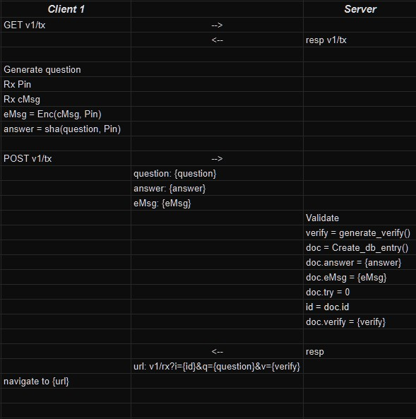
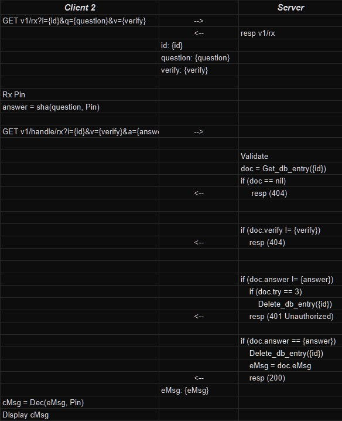

# Granitex
_italic A secure message transmission system_
Developed by: JD Sacharok [https://github.com/Gorillarock](https://github.com/Gorillarock)

## Dependecies
1. docker
- For installation instructions follow: [https://docs.docker.com/get-started/get-docker/](https://docs.docker.com/get-started/get-docker/)
2. make
- For Linux:
    ```
    sudo apt-get install make
    ```
    _italic NOTE: may use different package manager, such as apt, if your distro is different._
- For Mac:
    ```
    brew install make
    ```
    _italic NOTE: will require brew package manager  [https://brew.sh/](https://brew.sh/)_
- For Windows:
    Follow instructions here [https://gnuwin32.sourceforge.net/packages/make.htm](https://gnuwin32.sourceforge.net/packages/make.htm)


## Getting Started
1. Create a .env file in the same directory as the existing .env.dist file.
2. Provide values for all of the ENV keys in the .env file.
    _italic NOTE: Choose what you want, because the MongoDB and Server will each use the provided values._
3. Run Command:
    ```
    make run
    ```
4. In a browser, navigate to [http://localhost:80/v1/tx](http://localhost:80/v1/tx)


## Clients
### v1/tx client
#### Process


#### Usage
1. Fill out fields:
    - Fields
        - Message: Enter a message which you would like to transmit in secret.
        - PIN:     A secret code to be used for encrypting/decrypting the encrypted message.
2. Press _italic Submit_ button
NOTE: At any time, the granitex logo can be clicked to refresh the Tx client.


### v2/rx client
#### Process


#### Usage
1. Fill out fields:
    - Fields:
        - PIN: The secret code to be used for decrypting the encrypted message.
        _italic NOTE: The same one used when submitting with tx client._
2. Press _italic Get_ button
NOTE: At any time, the granitex logo can be clicked to navigate to the Tx client.


## Deployment Notes
_italic Advisements before deploying for production usage._
- Add TLS options to Server for Production Deployment.
- Use a dedicated Atlas or self-hosted MongoDB solution (docker-compose is only advised for local use).


## Development
### Nice to haves
- A user management system:
    - Log in to manage stored messages.
    - Enables billing based on usage.
- Time to live for all entries (unless logged into proper tier).
- Tooltips to for fields which explain their usage.
